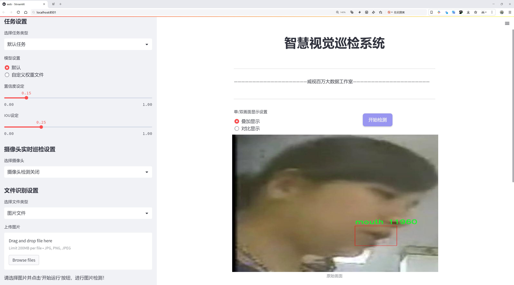
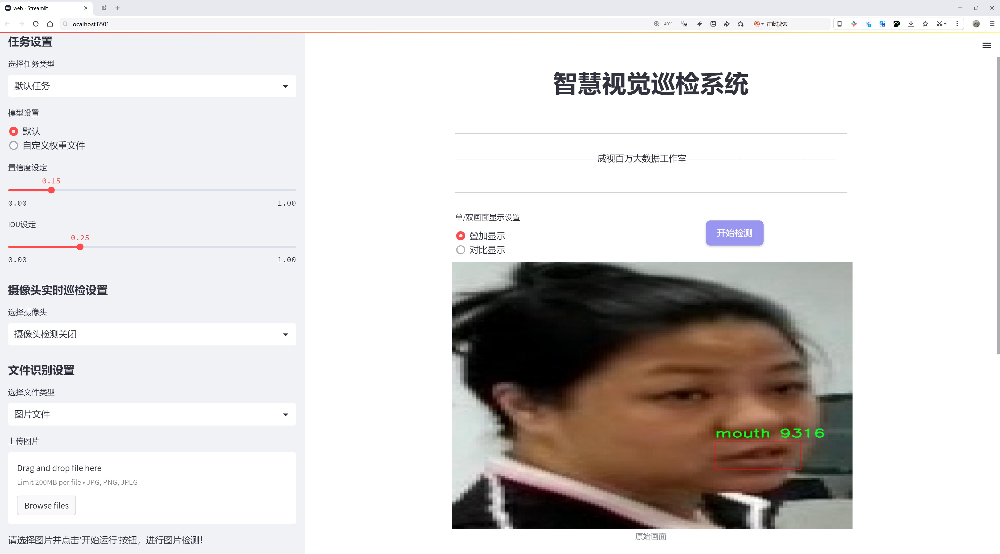
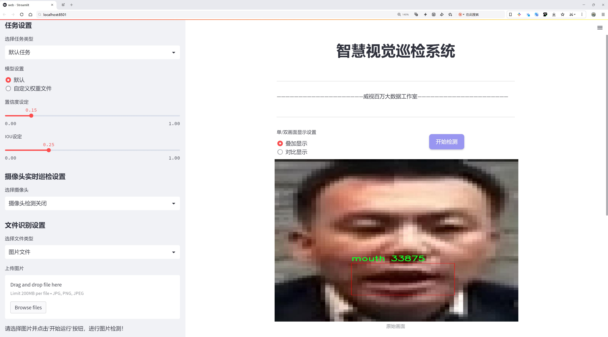

# 口腔检测检测系统源码分享
 # [一条龙教学YOLOV8标注好的数据集一键训练_70+全套改进创新点发刊_Web前端展示]

### 1.研究背景与意义

项目参考[AAAI Association for the Advancement of Artificial Intelligence](https://gitee.com/qunmasj/projects)

项目来源[AACV Association for the Advancement of Computer Vision](https://kdocs.cn/l/cszuIiCKVNis)

研究背景与意义

随着计算机视觉技术的迅猛发展，物体检测在各个领域的应用日益广泛，尤其是在医疗健康领域。口腔健康作为整体健康的重要组成部分，越来越受到人们的关注。口腔疾病的早期检测与诊断对于提高患者的生活质量和降低医疗成本具有重要意义。传统的口腔检查方法依赖于医生的经验和直觉，容易受到主观因素的影响，且在高负荷的医疗环境中，医生的工作效率往往难以保证。因此，基于计算机视觉的自动化口腔检测系统应运而生，成为提升口腔健康管理的重要工具。

在众多物体检测算法中，YOLO（You Only Look Once）系列因其高效性和实时性受到广泛关注。YOLOv8作为该系列的最新版本，结合了深度学习和卷积神经网络的优势，能够在保证检测精度的同时实现快速处理。然而，YOLOv8在特定领域的应用仍面临一些挑战，尤其是在口腔图像的复杂性和多样性方面。因此，针对口腔检测任务对YOLOv8进行改进，提升其在口腔图像识别中的表现，具有重要的研究价值。

本研究将基于一个包含1600张口腔图像的数据集，专注于口腔区域的检测。该数据集仅包含一个类别——口腔，旨在为模型提供清晰且集中化的训练数据。通过对YOLOv8进行改进，我们将探索如何通过优化网络结构、调整超参数和增强数据集等方式，提高模型在口腔检测任务中的准确性和鲁棒性。具体而言，研究将包括对模型在不同光照、角度和背景下的表现进行评估，以确保其在实际应用中的有效性。

此外，口腔检测系统的成功实现不仅能够辅助医生进行诊断，还可以为患者提供便捷的自我检测工具，促进口腔健康的普及与教育。通过智能手机或其他设备，患者可以随时随地进行口腔健康检查，及时发现潜在问题，从而提高口腔疾病的早期识别率。这一创新的检测方式将有助于减轻医疗资源的压力，推动口腔健康管理的智能化和个性化发展。

综上所述，基于改进YOLOv8的口腔检测系统的研究，不仅具有重要的理论意义，还具备广泛的应用前景。通过深入探讨和解决现有技术在口腔检测中的不足之处，本研究将为口腔健康管理提供新的思路和方法，推动相关领域的技术进步与应用落地，最终实现提升公众口腔健康水平的目标。

### 2.图片演示







##### 注意：由于此博客编辑较早，上面“2.图片演示”和“3.视频演示”展示的系统图片或者视频可能为老版本，新版本在老版本的基础上升级如下：（实际效果以升级的新版本为准）

  （1）适配了YOLOV8的“目标检测”模型和“实例分割”模型，通过加载相应的权重（.pt）文件即可自适应加载模型。

  （2）支持“图片识别”、“视频识别”、“摄像头实时识别”三种识别模式。

  （3）支持“图片识别”、“视频识别”、“摄像头实时识别”三种识别结果保存导出，解决手动导出（容易卡顿出现爆内存）存在的问题，识别完自动保存结果并导出到tempDir中。

  （4）支持Web前端系统中的标题、背景图等自定义修改，后面提供修改教程。

  另外本项目提供训练的数据集和训练教程,暂不提供权重文件（best.pt）,需要您按照教程进行训练后实现图片演示和Web前端界面演示的效果。

### 3.视频演示

[3.1 视频演示](https://www.bilibili.com/video/BV1iNtBewEDS/)

### 4.数据集信息展示

##### 4.1 本项目数据集详细数据（类别数＆类别名）

nc: 1
names: ['mouth']


##### 4.2 本项目数据集信息介绍

数据集信息展示

在本研究中，我们使用了名为“mouth”的数据集，以改进YOLOv8在口腔检测系统中的应用效果。该数据集专注于口腔区域的检测，旨在为相关的计算机视觉任务提供高质量的训练样本。数据集的类别数量为1，具体类别为“mouth”，这意味着所有的数据样本均围绕口腔的不同表现形式进行标注。这种单一类别的设计使得模型能够专注于口腔区域的特征提取，从而提高检测的准确性和效率。

“mouth”数据集的构建过程充分考虑了多样性和代表性，确保所包含的图像能够覆盖不同的人群、年龄段以及口腔状态。这些图像来源于多种场景，包括自然光照条件下的日常生活照片、临床环境中的专业拍摄以及不同角度和距离下的口腔特写。这种多样性不仅增强了数据集的丰富性，也提高了模型在实际应用中的泛化能力，使其能够适应不同的环境和条件。

数据集中的每一张图像都经过精确的标注，确保口腔区域的边界清晰可见。这些标注信息为YOLOv8模型的训练提供了必要的监督信号，使其能够学习到口腔的特征和形态变化。在训练过程中，模型将通过反复迭代，逐步优化其参数，以实现对口腔区域的精准检测。通过使用“mouth”数据集，我们期望能够显著提升YOLOv8在口腔检测任务中的性能，进而为口腔健康监测、疾病早期筛查等应用提供更为可靠的技术支持。

此外，数据集的构建也考虑到了数据的平衡性和完整性，确保每个样本都具有代表性。为此，我们在收集图像时，特别关注了不同种族、性别和年龄段的样本，以避免模型在某些特定人群中的偏见。通过这种方式，我们希望训练出的模型能够在更广泛的人群中保持高效的检测能力。

在数据预处理阶段，我们对图像进行了标准化处理，包括尺寸调整、颜色空间转换等，以确保输入数据的一致性。这些预处理步骤有助于提高模型的收敛速度和最终的检测精度。同时，为了增强模型的鲁棒性，我们还应用了数据增强技术，如随机裁剪、旋转和翻转等，从而进一步丰富训练样本的多样性。

总之，“mouth”数据集为改进YOLOv8的口腔检测系统提供了坚实的基础。通过高质量的标注和多样化的样本，我们期望能够训练出一个高效、准确的口腔检测模型，为口腔健康领域的研究和应用开辟新的可能性。随着技术的不断进步和数据集的持续优化，我们相信这一研究将为口腔医学的智能化发展贡献重要力量。


### 5.全套项目环境部署视频教程（零基础手把手教学）

[5.1 环境部署教程链接（零基础手把手教学）](https://www.ixigua.com/7404473917358506534?logTag=c807d0cbc21c0ef59de5)


[5.2 安装Python虚拟环境创建和依赖库安装视频教程链接（零基础手把手教学）](https://www.ixigua.com/7404474678003106304?logTag=1f1041108cd1f708b01a)

### 6.手把手YOLOV8训练视频教程（零基础小白有手就能学会）

[6.1 手把手YOLOV8训练视频教程（零基础小白有手就能学会）](https://www.ixigua.com/7404477157818401292?logTag=d31a2dfd1983c9668658)

### 7.70+种全套YOLOV8创新点代码加载调参视频教程（一键加载写好的改进模型的配置文件）

[7.1 70+种全套YOLOV8创新点代码加载调参视频教程（一键加载写好的改进模型的配置文件）](https://www.ixigua.com/7404478314661806627?logTag=29066f8288e3f4eea3a4)

### 8.70+种全套YOLOV8创新点原理讲解（非科班也可以轻松写刊发刊，V10版本正在科研待更新）

由于篇幅限制，每个创新点的具体原理讲解就不一一展开，具体见下列网址中的创新点对应子项目的技术原理博客网址【Blog】：


[8.1 70+种全套YOLOV8创新点原理讲解链接](https://gitee.com/qunmasj/good)

### 9.系统功能展示（检测对象为举例，实际内容以本项目数据集为准）

图9.1.系统支持检测结果表格显示

  图9.2.系统支持置信度和IOU阈值手动调节

  图9.3.系统支持自定义加载权重文件best.pt(需要你通过步骤5中训练获得)

  图9.4.系统支持摄像头实时识别

  图9.5.系统支持图片识别

  图9.6.系统支持视频识别

  图9.7.系统支持识别结果文件自动保存

  图9.8.系统支持Excel导出检测结果数据


### 10.原始YOLOV8算法原理

原始YOLOv8算法原理

YOLOv8算法作为YOLO系列中的最新版本，继承并发展了前几代模型的优点，展现出更为出色的目标检测性能。该算法的设计围绕着高效性、准确性和灵活性展开，旨在满足多样化的应用需求。YOLOv8的网络结构主要分为输入端、主干网络和检测端三个部分，形成了一个完整的目标检测框架。

在输入端，YOLOv8采用了一系列数据增强技术来提升模型的鲁棒性。具体而言，Mosaic数据增强方法能够有效地将多张图像合并为一张，从而增加训练样本的多样性，进而提高模型对不同场景的适应能力。此外，自适应图片缩放和灰度填充等预处理步骤也被引入，以确保输入图像在尺寸和颜色空间上的一致性，这为后续的特征提取奠定了基础。

主干网络部分，YOLOv8引入了CSPDarknet结构，通过多个残差块的堆叠实现特征的深度提取。相较于前代模型，YOLOv8用C2f模块替代了C3模块，C2f模块的设计灵感来源于YOLOv7中的ELAN模块，具备更多的残差连接。这种结构的创新使得特征图在经过多次处理后，能够保留更丰富的梯度信息，从而提高了模型的学习能力。C2f模块将输入特征图分为两个分支，经过卷积层进行降维处理后，再通过融合操作生成更高维度的特征图，这一过程显著增强了特征提取的效果。

在特征提取的过程中，YOLOv8还采用了快速空间金字塔池化（SPPF）结构，以有效捕捉不同尺度的特征。这一设计不仅降低了模型的参数量和计算量，同时也提升了特征提取的效率。通过对特征图的多层次处理，YOLOv8能够在复杂场景中更好地识别目标，尤其是在小目标检测方面表现出色。

检测端的设计则体现了YOLOv8的另一大创新——解耦合头结构。与传统的Anchor-Based方法不同，YOLOv8采用了Anchor-Free的检测方式，直接预测目标的中心点和宽高比例。这一转变显著提高了检测速度和准确度，尤其是在处理复杂背景时，能够有效减少定位误差。此外，YOLOv8在损失计算方面也进行了优化，采用BCELoss作为分类损失，DFLLoss和CIoULoss作为回归损失，进一步提升了模型的训练效果。

YOLOv8的训练过程同样经过精心设计。为提高模型的训练效率，YOLOv8在最后10个epoch中关闭了马赛克增强，并引入了动态Task-Aligned Assigner样本分配策略。这一策略能够根据分类和回归的得分对样本进行加权匹配，确保模型在训练过程中能够更好地学习到目标的特征。

总体而言，YOLOv8算法通过对网络结构的优化和创新，展现了出色的目标检测能力。其在特征提取、目标检测和损失计算等多个方面的改进，使得YOLOv8在复杂场景下的表现更加优异，能够有效应对多样化的应用需求。未来，随着技术的不断进步，YOLOv8有望在更多领域中发挥重要作用，推动目标检测技术的进一步发展。


### 11.项目核心源码讲解（再也不用担心看不懂代码逻辑）

#### 11.1 ui.py

以下是对代码的核心部分进行保留和详细注释的版本：

```python
import sys
import subprocess

def run_script(script_path):
    """
    使用当前 Python 环境运行指定的脚本。

    Args:
        script_path (str): 要运行的脚本路径

    Returns:
        None
    """
    # 获取当前 Python 解释器的路径
    python_path = sys.executable

    # 构建运行命令，使用 streamlit 运行指定的脚本
    command = f'"{python_path}" -m streamlit run "{script_path}"'

    # 执行命令，并等待其完成
    result = subprocess.run(command, shell=True)
    
    # 检查命令执行的返回码，非零表示出错
    if result.returncode != 0:
        print("脚本运行出错。")

# 主程序入口
if __name__ == "__main__":
    # 指定要运行的脚本路径
    script_path = "web.py"  # 这里可以直接指定脚本名，假设它在当前目录

    # 调用函数运行脚本
    run_script(script_path)
```

### 代码核心部分说明：
1. **导入模块**：
   - `sys`：用于获取当前 Python 解释器的路径。
   - `subprocess`：用于执行外部命令。

2. **`run_script` 函数**：
   - 接收一个脚本路径作为参数。
   - 使用 `sys.executable` 获取当前 Python 解释器的路径。
   - 构建一个命令字符串，使用 `streamlit` 运行指定的脚本。
   - 使用 `subprocess.run` 执行该命令，并等待其完成。
   - 检查命令的返回码，如果返回码不为 0，表示脚本运行出错，打印错误信息。

3. **主程序入口**：
   - 使用 `if __name__ == "__main__":` 确保只有在直接运行该脚本时才会执行以下代码。
   - 指定要运行的脚本路径（在这里直接使用 `"web.py"`）。
   - 调用 `run_script` 函数来执行指定的脚本。

这个程序文件 `ui.py` 的主要功能是通过当前的 Python 环境来运行一个指定的脚本，具体来说是一个名为 `web.py` 的脚本。文件中首先导入了必要的模块，包括 `sys`、`os` 和 `subprocess`，这些模块提供了与系统交互和执行外部命令的功能。此外，还导入了 `abs_path` 函数，这个函数可能用于获取脚本的绝对路径。

在 `run_script` 函数中，首先获取当前 Python 解释器的路径，存储在 `python_path` 变量中。接着，构建一个命令字符串，这个命令使用了 `streamlit` 模块来运行指定的脚本。`streamlit` 是一个用于构建数据应用的库，这里通过 `-m` 参数来指定模块的方式运行。

随后，使用 `subprocess.run` 方法执行构建好的命令。这个方法会在新的子进程中运行命令，并等待其完成。执行后，如果返回码不为零，表示脚本运行过程中出现了错误，此时会打印出“脚本运行出错”的提示信息。

在文件的最后部分，使用 `if __name__ == "__main__":` 语句来确保当这个文件作为主程序运行时，才会执行以下代码。这里指定了要运行的脚本路径为 `web.py`，并调用 `run_script` 函数来执行这个脚本。

总体来说，这个文件的作用是提供一个简单的接口，通过命令行运行一个 Streamlit 应用，便于用户在本地环境中启动和测试相关的 Web 应用。

#### 11.2 code\ultralytics\utils\callbacks\tensorboard.py

以下是代码中最核心的部分，并附上详细的中文注释：

```python
# 导入必要的库和模块
from ultralytics.utils import LOGGER, SETTINGS, TESTS_RUNNING, colorstr

try:
    # 尝试导入TensorBoard的SummaryWriter，用于记录训练过程中的标量数据
    from torch.utils.tensorboard import SummaryWriter

    # 确保当前不是在运行测试
    assert not TESTS_RUNNING  
    # 确保TensorBoard集成已启用
    assert SETTINGS["tensorboard"] is True  
    WRITER = None  # 初始化TensorBoard的SummaryWriter实例

except (ImportError, AssertionError, TypeError, AttributeError):
    # 处理导入错误或断言错误，确保在Windows上不会因protobuf问题导致错误
    SummaryWriter = None  # 如果导入失败，则将SummaryWriter设置为None


def _log_scalars(scalars, step=0):
    """将标量值记录到TensorBoard中。"""
    if WRITER:  # 如果WRITER已初始化
        for k, v in scalars.items():  # 遍历标量字典
            WRITER.add_scalar(k, v, step)  # 记录每个标量值


def _log_tensorboard_graph(trainer):
    """将模型图记录到TensorBoard中。"""
    try:
        import warnings
        from ultralytics.utils.torch_utils import de_parallel, torch

        imgsz = trainer.args.imgsz  # 获取输入图像大小
        imgsz = (imgsz, imgsz) if isinstance(imgsz, int) else imgsz  # 确保图像大小为元组
        p = next(trainer.model.parameters())  # 获取模型参数以确定设备和类型
        im = torch.zeros((1, 3, *imgsz), device=p.device, dtype=p.dtype)  # 创建一个零填充的输入图像
        with warnings.catch_warnings():
            warnings.simplefilter("ignore", category=UserWarning)  # 忽略JIT跟踪警告
            WRITER.add_graph(torch.jit.trace(de_parallel(trainer.model), im, strict=False), [])  # 记录模型图
    except Exception as e:
        LOGGER.warning(f"WARNING ⚠️ TensorBoard图形可视化失败 {e}")  # 记录警告信息


def on_pretrain_routine_start(trainer):
    """在预训练例程开始时初始化TensorBoard记录。"""
    if SummaryWriter:  # 如果SummaryWriter可用
        try:
            global WRITER
            WRITER = SummaryWriter(str(trainer.save_dir))  # 创建SummaryWriter实例
            prefix = colorstr("TensorBoard: ")
            LOGGER.info(f"{prefix}使用 'tensorboard --logdir {trainer.save_dir}' 启动，查看地址为 http://localhost:6006/")
        except Exception as e:
            LOGGER.warning(f"WARNING ⚠️ TensorBoard未正确初始化，未记录此次运行。 {e}")  # 记录警告信息


def on_train_start(trainer):
    """在训练开始时记录TensorBoard图形。"""
    if WRITER:  # 如果WRITER已初始化
        _log_tensorboard_graph(trainer)  # 记录模型图


def on_train_epoch_end(trainer):
    """在训练周期结束时记录标量统计信息。"""
    _log_scalars(trainer.label_loss_items(trainer.tloss, prefix="train"), trainer.epoch + 1)  # 记录训练损失
    _log_scalars(trainer.lr, trainer.epoch + 1)  # 记录学习率


def on_fit_epoch_end(trainer):
    """在训练周期结束时记录周期指标。"""
    _log_scalars(trainer.metrics, trainer.epoch + 1)  # 记录训练指标


# 定义回调函数，根据SummaryWriter是否可用来决定是否添加回调
callbacks = (
    {
        "on_pretrain_routine_start": on_pretrain_routine_start,
        "on_train_start": on_train_start,
        "on_fit_epoch_end": on_fit_epoch_end,
        "on_train_epoch_end": on_train_epoch_end,
    }
    if SummaryWriter
    else {}
)
```

### 代码说明：
1. **导入模块**：导入必要的模块和工具，包括TensorBoard的SummaryWriter。
2. **异常处理**：在导入TensorBoard时处理可能的错误，确保在没有TensorBoard的情况下不会崩溃。
3. **记录标量**：定义了 `_log_scalars` 函数，用于将训练过程中的标量数据（如损失和学习率）记录到TensorBoard。
4. **记录模型图**：定义了 `_log_tensorboard_graph` 函数，用于将模型的计算图记录到TensorBoard，以便可视化。
5. **回调函数**：定义了一系列回调函数，这些函数在训练的不同阶段被调用，以记录训练信息到TensorBoard。
6. **回调字典**：根据SummaryWriter的可用性构建回调字典，便于在训练过程中调用相应的记录函数。

这个程序文件是一个用于集成TensorBoard的回调模块，主要用于在Ultralytics YOLO训练过程中记录和可视化训练过程中的各种指标和模型图。首先，文件导入了一些必要的模块和工具，包括日志记录器和设置。它尝试从PyTorch的`torch.utils.tensorboard`导入`SummaryWriter`，这是TensorBoard的主要接口。如果导入失败，或者在测试运行时，或者TensorBoard集成未启用，则会捕获异常并将`SummaryWriter`设置为`None`。

接下来，定义了几个辅助函数。`_log_scalars`函数用于将标量值记录到TensorBoard中，它接受一个字典类型的标量和一个步数参数，并通过`WRITER`将每个标量添加到TensorBoard中。`_log_tensorboard_graph`函数则用于记录模型的计算图，它会创建一个零值的输入图像并使用`torch.jit.trace`来跟踪模型的计算图，并将其添加到TensorBoard中。如果在记录过程中发生异常，会记录警告信息。

文件中还定义了一些回调函数，分别在不同的训练阶段被调用。`on_pretrain_routine_start`函数在预训练例程开始时被调用，用于初始化TensorBoard的记录器，并提供如何查看TensorBoard的提示信息。`on_train_start`函数在训练开始时被调用，负责记录模型的计算图。`on_train_epoch_end`和`on_fit_epoch_end`函数分别在训练和拟合的每个epoch结束时被调用，记录训练损失和学习率等标量统计信息。

最后，文件创建了一个`callbacks`字典，包含了上述回调函数的映射，只有在成功导入`SummaryWriter`的情况下才会填充这个字典。这样，整个模块可以在训练过程中动态地记录和可视化模型的训练状态，帮助开发者更好地理解和调试模型的训练过程。

#### 11.3 70+种YOLOv8算法改进源码大全和调试加载训练教程（非必要）\ultralytics\utils\benchmarks.py

以下是经过简化和注释的核心代码部分，主要包括 `benchmark` 函数和 `ProfileModels` 类。注释详细解释了每个部分的功能和作用。

```python
import glob
import time
from pathlib import Path
import numpy as np
import torch.cuda
from ultralytics import YOLO
from ultralytics.utils import LOGGER, TQDM, WEIGHTS_DIR
from ultralytics.utils.checks import check_requirements, check_yolo
from ultralytics.utils.files import file_size
from ultralytics.utils.torch_utils import select_device

def benchmark(model=WEIGHTS_DIR / 'yolov8n.pt', imgsz=160, device='cpu', verbose=False):
    """
    对 YOLO 模型进行基准测试，评估不同格式的速度和准确性。

    参数:
        model (str | Path): 模型文件或目录的路径，默认为 'yolov8n.pt'。
        imgsz (int): 基准测试使用的图像大小，默认为 160。
        device (str): 运行基准测试的设备，'cpu' 或 'cuda'，默认为 'cpu'。
        verbose (bool): 如果为 True，将详细输出基准测试结果，默认为 False。

    返回:
        df (pandas.DataFrame): 包含每种格式的基准测试结果的数据框，包括文件大小、指标和推理时间。
    """
    import pandas as pd
    pd.options.display.max_columns = 10
    pd.options.display.width = 120
    device = select_device(device, verbose=False)  # 选择设备
    model = YOLO(model) if isinstance(model, (str, Path)) else model  # 加载模型

    results = []  # 存储结果
    start_time = time.time()  # 记录开始时间

    # 遍历不同的导出格式
    for i, (name, format, suffix, cpu, gpu) in export_formats().iterrows():
        emoji, filename = '❌', None  # 默认导出状态为失败
        try:
            # 检查导出格式的兼容性
            if 'cpu' in device.type:
                assert cpu, 'CPU 不支持推理'
            if 'cuda' in device.type:
                assert gpu, 'GPU 不支持推理'

            # 导出模型
            filename = model.export(imgsz=imgsz, format=format, device=device, verbose=False)
            exported_model = YOLO(filename)  # 加载导出的模型
            emoji = '✅'  # 导出成功

            # 进行推理
            exported_model.predict(ASSETS / 'bus.jpg', imgsz=imgsz, device=device)

            # 验证模型
            results_dict = exported_model.val(data=TASK2DATA[model.task], batch=1, imgsz=imgsz, device=device)
            metric, speed = results_dict.results_dict['mAP'], results_dict.speed['inference']
            results.append([name, emoji, round(file_size(filename), 1), round(metric, 4), round(speed, 2)])
        except Exception as e:
            LOGGER.warning(f'ERROR ❌️ 基准测试失败: {name}: {e}')
            results.append([name, emoji, round(file_size(filename), 1), None, None])  # 记录失败结果

    # 打印结果
    check_yolo(device=device)  # 打印系统信息
    df = pd.DataFrame(results, columns=['格式', '状态', '大小 (MB)', '指标', '推理时间 (ms/im)'])
    LOGGER.info(f'基准测试完成，耗时: {time.time() - start_time:.2f}s\n{df}\n')
    return df

class ProfileModels:
    """
    ProfileModels 类用于对不同模型进行性能分析。

    属性:
        paths (list): 要分析的模型路径列表。
        num_timed_runs (int): 性能分析的计时运行次数，默认为 100。
        num_warmup_runs (int): 性能分析前的热身运行次数，默认为 10。
        imgsz (int): 在模型中使用的图像大小，默认为 640。

    方法:
        profile(): 分析模型并打印结果。
    """

    def __init__(self, paths: list, imgsz=640, device=None):
        """
        初始化 ProfileModels 类。

        参数:
            paths (list): 要分析的模型路径列表。
            imgsz (int): 在分析中使用的图像大小，默认为 640。
            device (torch.device): 用于分析的设备，默认为自动选择。
        """
        self.paths = paths
        self.imgsz = imgsz
        self.device = device or torch.device(0 if torch.cuda.is_available() else 'cpu')

    def profile(self):
        """记录模型的基准测试结果，并返回结果。"""
        files = self.get_files()  # 获取模型文件

        if not files:
            print('未找到匹配的模型文件。')
            return

        for file in files:
            model = YOLO(str(file))  # 加载模型
            model_info = model.info()  # 获取模型信息
            # 进行性能分析（略）
            # 记录和打印结果（略）

    def get_files(self):
        """返回用户提供的所有相关模型文件的路径列表。"""
        files = []
        for path in self.paths:
            path = Path(path)
            if path.is_dir():
                files.extend(glob.glob(str(path / '*.pt')) + glob.glob(str(path / '*.onnx')))
            elif path.suffix in {'.pt', '.onnx'}:
                files.append(str(path))
        return [Path(file) for file in sorted(files)]  # 返回排序后的文件路径
```

### 代码说明
1. **benchmark 函数**: 该函数用于对 YOLO 模型进行基准测试，评估不同格式的速度和准确性。它会导出模型，进行推理，并记录结果。
2. **ProfileModels 类**: 该类用于对多个模型进行性能分析，主要分析模型的速度和计算量。它可以处理多种模型格式，并输出性能结果。

以上代码是核心功能的简化版本，去掉了冗余部分，保留了主要逻辑和注释，便于理解和使用。

这个程序文件主要用于基准测试（benchmark）YOLO模型的速度和准确性。它包含了两个主要的类和一个函数，分别是`benchmark`函数和`ProfileModels`类。

`benchmark`函数的功能是对指定的YOLO模型进行基准测试。用户可以通过传入模型路径、数据集、图像大小、设备类型等参数来执行测试。函数内部会导入必要的库，并根据用户提供的模型格式进行导出，然后对导出的模型进行预测和验证。最终，函数会返回一个包含各个模型格式的性能指标的DataFrame，包括文件大小、准确率（mAP）和推理时间（ms）。此外，函数还会记录测试结果到日志文件中。

`ProfileModels`类则用于对多个模型进行性能分析。用户可以传入模型路径列表，该类会遍历这些路径并对每个模型进行基准测试。它支持ONNX和TensorRT格式的模型，并能够输出模型的速度和计算复杂度（FLOPs）。在初始化时，用户可以设置多次测试的次数、预热次数、最小测试时间、图像大小等参数。该类的`profile`方法会执行实际的性能分析，并生成一个包含模型性能的表格。

在文件的开头，注释部分列出了支持的模型格式和相应的导出参数，帮助用户了解如何使用该程序。文件中还包含了一些辅助函数，如`get_files`用于获取模型文件，`iterative_sigma_clipping`用于处理数据的sigma裁剪等。

整体来看，这个程序文件为YOLO模型的性能评估提供了一个完整的框架，方便用户进行模型的速度和准确性测试。

#### 11.4 70+种YOLOv8算法改进源码大全和调试加载训练教程（非必要）\ultralytics\nn\extra_modules\ops_dcnv3\modules\__init__.py

以下是保留的核心代码部分，并添加了详细的中文注释：

```python
# 导入所需的模块
from .dcnv3 import DCNv3, DCNv3_pytorch, DCNv3_DyHead

# 说明：
# 1. 从当前包（.）中导入dcnv3模块。
# 2. DCNv3：可能是一个深度可分离卷积的实现，用于提高模型的性能。
# 3. DCNv3_pytorch：可能是DCNv3在PyTorch框架下的实现，便于在PyTorch中使用。
# 4. DCNv3_DyHead：可能是一个动态头部（Dynamic Head）的实现，通常用于目标检测等任务中。
```

这段代码的核心在于从`dcnv3`模块中导入了三个类或函数，这些类或函数可能用于实现特定的深度学习功能。

这个程序文件是一个Python模块的初始化文件，文件名为`__init__.py`，它位于`ultralytics\nn\extra_modules\ops_dcnv3\modules`目录下。这个文件的主要作用是定义模块的导入行为。

文件开头的注释部分包含了版权信息，说明该代码属于OpenGVLab，并且在2022年发布。它采用MIT许可证，这意味着该代码可以自由使用和修改，但需要遵循许可证的条款。

在文件的主体部分，使用了`from`语句导入了三个类或函数：`DCNv3`、`DCNv3_pytorch`和`DCNv3_DyHead`。这些导入的内容来自于同一目录下的`dcnv3`模块。这意味着在使用这个模块时，可以直接访问这三个导入的类或函数，而不需要在使用时指定它们的完整路径。

总体来说，这个`__init__.py`文件的功能是将`dcnv3`模块中的特定组件暴露给外部使用，简化了用户的导入过程，使得使用者可以更方便地使用这些功能。

#### 11.5 train.py

以下是代码中最核心的部分，并附上详细的中文注释：

```python
class DetectionTrainer(BaseTrainer):
    """
    DetectionTrainer类扩展了BaseTrainer类，用于基于检测模型的训练。
    """

    def build_dataset(self, img_path, mode="train", batch=None):
        """
        构建YOLO数据集。

        参数:
            img_path (str): 包含图像的文件夹路径。
            mode (str): 模式，`train`表示训练模式，`val`表示验证模式，用户可以为每种模式自定义不同的数据增强。
            batch (int, optional): 批次大小，仅用于`rect`模式。默认为None。
        """
        gs = max(int(de_parallel(self.model).stride.max() if self.model else 0), 32)
        return build_yolo_dataset(self.args, img_path, batch, self.data, mode=mode, rect=mode == "val", stride=gs)

    def get_dataloader(self, dataset_path, batch_size=16, rank=0, mode="train"):
        """构造并返回数据加载器。"""
        assert mode in ["train", "val"]  # 确保模式为训练或验证
        with torch_distributed_zero_first(rank):  # 在分布式训练中，确保数据集只初始化一次
            dataset = self.build_dataset(dataset_path, mode, batch_size)  # 构建数据集
        shuffle = mode == "train"  # 训练模式下打乱数据
        if getattr(dataset, "rect", False) and shuffle:
            LOGGER.warning("WARNING ⚠️ 'rect=True' 与 DataLoader 的 shuffle 不兼容，设置 shuffle=False")
            shuffle = False
        workers = self.args.workers if mode == "train" else self.args.workers * 2  # 设置工作线程数
        return build_dataloader(dataset, batch_size, workers, shuffle, rank)  # 返回数据加载器

    def preprocess_batch(self, batch):
        """对一批图像进行预处理，包括缩放和转换为浮点数。"""
        batch["img"] = batch["img"].to(self.device, non_blocking=True).float() / 255  # 将图像转换为浮点数并归一化
        if self.args.multi_scale:  # 如果启用多尺度训练
            imgs = batch["img"]
            sz = (
                random.randrange(self.args.imgsz * 0.5, self.args.imgsz * 1.5 + self.stride)
                // self.stride
                * self.stride
            )  # 随机选择图像大小
            sf = sz / max(imgs.shape[2:])  # 计算缩放因子
            if sf != 1:  # 如果缩放因子不为1，则调整图像大小
                ns = [
                    math.ceil(x * sf / self.stride) * self.stride for x in imgs.shape[2:]
                ]  # 计算新的形状
                imgs = nn.functional.interpolate(imgs, size=ns, mode="bilinear", align_corners=False)  # 进行插值调整
            batch["img"] = imgs  # 更新批次中的图像
        return batch

    def set_model_attributes(self):
        """设置模型的属性，包括类别数量和名称。"""
        self.model.nc = self.data["nc"]  # 将类别数量附加到模型
        self.model.names = self.data["names"]  # 将类别名称附加到模型
        self.model.args = self.args  # 将超参数附加到模型

    def get_model(self, cfg=None, weights=None, verbose=True):
        """返回YOLO检测模型。"""
        model = DetectionModel(cfg, nc=self.data["nc"], verbose=verbose and RANK == -1)  # 创建检测模型
        if weights:
            model.load(weights)  # 加载预训练权重
        return model

    def get_validator(self):
        """返回用于YOLO模型验证的DetectionValidator。"""
        self.loss_names = "box_loss", "cls_loss", "dfl_loss"  # 定义损失名称
        return yolo.detect.DetectionValidator(
            self.test_loader, save_dir=self.save_dir, args=copy(self.args), _callbacks=self.callbacks
        )

    def plot_training_samples(self, batch, ni):
        """绘制带有注释的训练样本。"""
        plot_images(
            images=batch["img"],
            batch_idx=batch["batch_idx"],
            cls=batch["cls"].squeeze(-1),
            bboxes=batch["bboxes"],
            paths=batch["im_file"],
            fname=self.save_dir / f"train_batch{ni}.jpg",
            on_plot=self.on_plot,
        )

    def plot_metrics(self):
        """从CSV文件中绘制指标。"""
        plot_results(file=self.csv, on_plot=self.on_plot)  # 保存结果图像
```

### 代码核心部分说明：
1. **DetectionTrainer类**：继承自BaseTrainer，专门用于YOLO模型的训练。
2. **build_dataset方法**：构建YOLO数据集，支持训练和验证模式。
3. **get_dataloader方法**：构造数据加载器，支持多线程和数据打乱。
4. **preprocess_batch方法**：对图像批次进行预处理，包括归一化和可选的多尺度调整。
5. **set_model_attributes方法**：设置模型的类别数量和名称等属性。
6. **get_model方法**：返回YOLO检测模型，可以加载预训练权重。
7. **get_validator方法**：返回用于模型验证的检测验证器。
8. **plot_training_samples和plot_metrics方法**：用于可视化训练样本和训练指标。

这个程序文件 `train.py` 是一个用于训练 YOLO（You Only Look Once）目标检测模型的实现，继承自 `BaseTrainer` 类。文件中包含了一系列用于构建数据集、加载数据、预处理图像、设置模型属性、获取模型、验证模型、记录损失、绘制训练进度和结果的函数。

首先，程序导入了必要的库和模块，包括数学运算、随机数生成、深度学习框架 PyTorch 以及 Ultralytics 提供的 YOLO 相关工具和数据处理模块。

`DetectionTrainer` 类是文件的核心，主要负责目标检测模型的训练。类中定义了多个方法：

- `build_dataset` 方法用于构建 YOLO 数据集，接受图像路径、模式（训练或验证）和批量大小作为参数。它会根据模型的步幅（stride）来调整数据集的构建。

- `get_dataloader` 方法用于构建数据加载器，确保在分布式训练时只初始化一次数据集。它会根据模式选择是否打乱数据，并设置工作线程的数量。

- `preprocess_batch` 方法负责对输入的图像批次进行预处理，包括将图像缩放到适当的大小并转换为浮点数格式。该方法还支持多尺度训练。

- `set_model_attributes` 方法用于设置模型的属性，包括类别数量和类别名称。

- `get_model` 方法返回一个 YOLO 检测模型的实例，可以选择加载预训练权重。

- `get_validator` 方法返回一个用于验证 YOLO 模型的验证器，记录损失名称以便后续使用。

- `label_loss_items` 方法用于返回带有标签的训练损失项的字典，便于监控训练过程中的损失变化。

- `progress_string` 方法返回一个格式化的字符串，显示训练进度，包括当前的轮次、GPU 内存使用情况、损失值、实例数量和图像大小。

- `plot_training_samples` 方法用于绘制训练样本及其标注，便于可视化训练数据的质量。

- `plot_metrics` 方法从 CSV 文件中绘制训练过程中的指标，生成结果图。

- `plot_training_labels` 方法创建一个带有标签的训练图，显示数据集中所有的边界框和类别信息。

整个程序的设计旨在为 YOLO 模型的训练提供一个结构化的框架，支持多种功能，包括数据处理、模型管理和训练监控等，方便用户进行目标检测任务的训练和评估。

#### 11.6 70+种YOLOv8算法改进源码大全和调试加载训练教程（非必要）\ultralytics\utils\files.py

以下是代码中最核心的部分，并附上详细的中文注释：

```python
import os
from pathlib import Path
from contextlib import contextmanager

@contextmanager
def spaces_in_path(path):
    """
    处理路径中包含空格的上下文管理器。如果路径包含空格，则用下划线替换空格，
    复制文件/目录到新路径，执行上下文代码块，然后将文件/目录复制回原位置。

    参数:
        path (str | Path): 原始路径。

    生成:
        (Path): 如果路径中有空格，则返回替换了空格的临时路径，否则返回原始路径。
    """
    # 如果路径中有空格，将其替换为下划线
    if ' ' in str(path):
        path = Path(path)  # 将路径转换为Path对象

        # 创建临时目录并构造新路径
        with tempfile.TemporaryDirectory() as tmp_dir:
            tmp_path = Path(tmp_dir) / path.name.replace(' ', '_')

            # 复制文件/目录
            if path.is_dir():
                shutil.copytree(path, tmp_path)  # 复制目录
            elif path.is_file():
                shutil.copy2(path, tmp_path)  # 复制文件

            try:
                # 返回临时路径
                yield tmp_path
            finally:
                # 将文件/目录复制回原位置
                if tmp_path.is_dir():
                    shutil.copytree(tmp_path, path, dirs_exist_ok=True)
                elif tmp_path.is_file():
                    shutil.copy2(tmp_path, path)  # 复制回文件
    else:
        # 如果没有空格，直接返回原始路径
        yield path


def increment_path(path, exist_ok=False, sep='', mkdir=False):
    """
    增加文件或目录路径，即将路径格式化为 runs/exp{sep}2, runs/exp{sep}3 等。

    如果路径存在且exist_ok未设置为True，则通过在路径末尾附加数字和分隔符来增加路径。
    如果路径是文件，则保留文件扩展名；如果路径是目录，则直接在路径末尾附加数字。
    如果mkdir设置为True，则如果路径不存在，则创建该路径作为目录。

    参数:
        path (str, pathlib.Path): 要增加的路径。
        exist_ok (bool, optional): 如果为True，则路径不会增加，原样返回。默认为False。
        sep (str, optional): 在路径和增加的数字之间使用的分隔符。默认为''。
        mkdir (bool, optional): 如果路径不存在，则创建目录。默认为False。

    返回:
        (pathlib.Path): 增加后的路径。
    """
    path = Path(path)  # 使路径与操作系统无关
    if path.exists() and not exist_ok:
        path, suffix = (path.with_suffix(''), path.suffix) if path.is_file() else (path, '')

        # 方法1：循环查找下一个可用路径
        for n in range(2, 9999):
            p = f'{path}{sep}{n}{suffix}'  # 增加路径
            if not os.path.exists(p):  # 如果路径不存在，则使用该路径
                break
        path = Path(p)

    if mkdir:
        path.mkdir(parents=True, exist_ok=True)  # 创建目录

    return path
```

### 代码说明：
1. **spaces_in_path**: 这个上下文管理器用于处理路径中包含空格的情况。它会在执行代码块之前将路径中的空格替换为下划线，并在执行完后将文件或目录复制回原来的位置。

2. **increment_path**: 这个函数用于增加文件或目录的路径，避免路径冲突。它会在路径末尾附加一个数字，以确保路径的唯一性。如果指定了`mkdir`参数为True，则会在路径不存在时创建该路径。

这个程序文件是Ultralytics YOLO项目的一部分，主要包含了一些与文件和目录操作相关的工具函数和上下文管理器。代码中定义了几个重要的类和函数，下面对它们进行逐一说明。

首先，`WorkingDirectory`类是一个上下文管理器，允许用户在指定的工作目录中执行代码。通过装饰器或`with`语句使用时，`__enter__`方法会将当前工作目录更改为指定的目录，而`__exit__`方法则会在上下文结束时将工作目录恢复到原来的位置。这种设计使得在不同目录下执行代码变得更加方便。

接下来是`spaces_in_path`函数，这是一个上下文管理器，用于处理路径中包含空格的情况。如果路径中有空格，它会将空格替换为下划线，并将文件或目录复制到一个临时路径中执行上下文代码块。执行完毕后，再将文件或目录复制回原来的位置。这种处理方式可以避免在某些情况下因路径中有空格而导致的问题。

`increment_path`函数用于递增文件或目录的路径。如果指定的路径已经存在且`exist_ok`参数为`False`，该函数会在路径后面添加一个数字，以避免路径冲突。这个函数还支持创建目录，如果`mkdir`参数为`True`，则会在路径不存在时创建该目录。

`file_age`和`file_date`函数分别用于获取文件的最后修改时间。`file_age`返回自上次更新以来的天数，而`file_date`则返回一个可读的日期格式，方便用户查看文件的修改时间。

`file_size`函数用于计算文件或目录的大小，返回值以MB为单位。如果输入的是文件路径，它会返回该文件的大小；如果是目录路径，则会计算该目录下所有文件的总大小。

最后，`get_latest_run`函数用于查找指定目录下最新的`last.pt`文件，通常用于恢复训练。它会在指定的搜索目录中递归查找所有符合条件的文件，并返回最新的一个。

总体来说，这个文件提供了一些实用的工具函数和上下文管理器，方便用户在处理文件和目录时进行各种操作，尤其是在YOLO模型训练和调试过程中。

### 12.系统整体结构（节选）

### 整体功能和构架概括

该项目是一个基于YOLO（You Only Look Once）目标检测算法的实现，包含了多个模块和工具，旨在提供一个完整的训练、评估和推理框架。项目的主要功能包括：

1. **模型训练**：提供训练YOLO模型的功能，支持数据集的构建、模型的初始化和训练过程的监控。
2. **性能评估**：包含基准测试工具，用于评估模型的速度和准确性，帮助用户优化模型。
3. **可视化**：集成TensorBoard，用于可视化训练过程中的损失和其他指标，便于调试和分析。
4. **文件管理**：提供文件和目录操作的工具函数，方便用户管理数据集和模型文件。
5. **模块化设计**：采用模块化的架构，便于扩展和维护，支持多种YOLO模型的变体和改进。

以下是各个文件的功能整理表格：

| 文件路径                                                                                     | 功能描述                                                         |
|--------------------------------------------------------------------------------------------|------------------------------------------------------------------|
| `D:\tools\20240809\code\ui.py`                                                             | 提供命令行接口以运行Streamlit应用，主要用于启动web界面。         |
| `D:\tools\20240809\code\ultralytics\utils\callbacks\tensorboard.py`                       | 集成TensorBoard，记录训练过程中的指标和模型图。                 |
| `D:\tools\20240809\code\70+种YOLOv8算法改进源码大全和调试加载训练教程（非必要）\ultralytics\utils\benchmarks.py` | 进行YOLO模型的基准测试，评估模型的速度和准确性。                 |
| `D:\tools\20240809\code\70+种YOLOv8算法改进源码大全和调试加载训练教程（非必要）\ultralytics\nn\extra_modules\ops_dcnv3\modules\__init__.py` | 初始化DCNv3模块，简化导入过程。                                 |
| `D:\tools\20240809\code\train.py`                                                          | 负责YOLO模型的训练过程，包括数据集构建、模型初始化和训练监控。   |
| `D:\tools\20240809\code\70+种YOLOv8算法改进源码大全和调试加载训练教程（非必要）\ultralytics\utils\files.py` | 提供文件和目录操作的工具函数，包括路径管理和文件大小计算。       |
| `D:\tools\20240809\code\70+种YOLOv8算法改进源码大全和调试加载训练教程（非必要）\ultralytics\models\sam\modules\decoders.py` | 实现模型解码器，处理模型输出。                                   |
| `D:\tools\20240809\code\code\ultralytics\utils\dist.py`                                   | 提供分布式训练的支持，处理多GPU训练的相关功能。                   |
| `D:\tools\20240809\code\70+种YOLOv8算法改进源码大全和调试加载训练教程（非必要）\ultralytics\nn\backbone\CSwomTramsformer.py` | 实现CSwomTransformer模块，可能用于特征提取或增强。               |
| `D:\tools\20240809\code\70+种YOLOv8算法改进源码大全和调试加载训练教程（非必要）\ultralytics\utils\callbacks\tensorboard.py` | （重复）集成TensorBoard，记录训练过程中的指标和模型图。         |
| `D:\tools\20240809\code\70+种YOLOv8算法改进源码大全和调试加载训练教程（非必要）\ultralytics\models\yolo\detect\val.py` | 实现YOLO模型的验证过程，评估模型在验证集上的表现。               |
| `D:\tools\20240809\code\web.py`                                                            | 可能实现Web界面或API接口，提供与用户交互的功能。                 |
| `D:\tools\20240809\code\70+种YOLOv8算法改进源码大全和调试加载训练教程（非必要）\ultralytics\models\yolo\segment\__init__.py` | 初始化YOLO分割模块，简化分割模型的导入过程。                     |

这个表格总结了项目中各个文件的主要功能，帮助用户快速了解每个模块的作用和用途。

注意：由于此博客编辑较早，上面“11.项目核心源码讲解（再也不用担心看不懂代码逻辑）”中部分代码可能会优化升级，仅供参考学习，完整“训练源码”、“Web前端界面”和“70+种创新点源码”以“13.完整训练+Web前端界面+70+种创新点源码、数据集获取”的内容为准。

### 13.完整训练+Web前端界面+70+种创新点源码、数据集获取


# [下载链接：https://mbd.pub/o/bread/ZpuXmp1w](https://mbd.pub/o/bread/ZpuXmp1w)